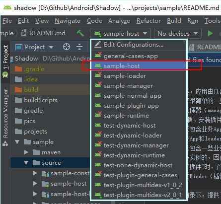

# 调试工具

1. API Monitor
   官网：[http://www.rohitab.com/apimonitor](http://www.rohitab.com/apimonitor)
   简介：对某个dll在某个软件中调用的函数追踪
2. Dependency Walker
   官网：[http://www.dependencywalker.com/](http://www.dependencywalker.com/)
   简介：对dll的函数进行分析

3. Beyond Compare 4
   网址：[Beyond Compare 4](https://touwoyimuli.github.io/2019/07/04/Beyond-Compare-4%E6%96%87%E4%BB%B6%E5%AF%B9%E6%AF%94%E7%A5%9E%E5%99%A8-%EF%BC%88%E5%B8%A6%E5%AE%98%E7%BD%91%E7%A6%BB%E7%BA%BF%E5%AE%89%E8%A3%85%E5%8C%85%E5%92%8C%E7%A0%B4%E8%A7%A3%E5%B7%A5%E5%85%B7%EF%BC%89-%E7%A0%B4%E8%A7%A3%E6%95%99%E7%A8%8B/)](https://touwoyimuli.github.io/2019/07/04/Beyond-Compare-4%E6%96%87%E4%BB%B6%E5%AF%B9%E6%AF%94%E7%A5%9E%E5%99%A8-%EF%BC%88%E5%B8%A6%E5%AE%98%E7%BD%91%E7%A6%BB%E7%BA%BF%E5%AE%89%E8%A3%85%E5%8C%85%E5%92%8C%E7%A0%B4%E8%A7%A3%E5%B7%A5%E5%85%B7%EF%BC%89-%E7%A0%B4%E8%A7%A3%E6%95%99%E7%A8%8B/)
   简介：文件对比神器
4. Xshell
   简介：连接云服务器

# 环境变量

## Android环境变量

1. 进入到环境配置界面  
2. 新建系统变量
   | 变量名 |变量值  |
   |:-:     |:-:    |
   |ANDROID_HOME|C:\Users\Petrichor\AppData\Local\Android\Sdk|
   *备注：改成你们sdk的路径*
3. 编辑系统路径（path）,添加以下两个路径
   | 变量名 |
   |---     |
   |%ANDROID_HOME%\tools|
   |%ANDROID_HOME%\platform-tools|
4. 测试
   命令行输入`adb`出现一整页文字，成功

# 编译器技巧

## Android Studio

- 快捷键
  |类型|功能|快捷键
  |:-:|:-:|:-:
  **`包类`**|
  ||导包|`alt` + `enter`
  ||删包|`ctrl` + `alt` + `O`
  **`代码类`**|
  ||代码补全|`ctrl` + `alt` + `space`
  ||代码格式化|`ctrl` + `alt` + `L`
  ||方法提示|`ctrl` + `shift` + `space`
  ||代码参数|`ctrl` + `P`
  ||变量重命名| + `shift` + `F6`
  ||查看定义|`ctrl` + `shift` + `I`
  **`查找类`**|
  ||类查找|`ctrl` + `N`
  ||查找文件|`shift` + `shift`
  ||定位到定义处|`ctrl` + `B`
  ||定位到出错处|`F2`
  ||全局搜索|`ctrl` + `shift` + `F`
  ||查找引用|`ctrl` + `alt` + `H`
  ||类元素结构|`ctrl` + `F12`
  ||指定位置|`ctrl` + `G`
  ||查找历史记录|`ctrl` + `alt` + `<-/->`
  **`界面类`**|
  ||显示/隐藏|`ctrl` + `shift` + `F12`
  ||返回代码编辑器|`esc`

1. 单个工程运行
   

2. 用自己的配置编译别人的工程
   [Android studio项目更换gradle版本](https://blog.csdn.net/e_one/article/details/79061640)